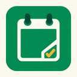

# Google Classroom Readonly MCP



このリポジトリを自分のCloudflareアカウントへデプロイし、自分のGoogleアカウントで使うためのプロジェクトです。共有サービスの接続先は提供しません。Googleの公式製品ではありません。

**初めて使う方は[個人デプロイガイド](docs/personal-deployment.md)を参照してください。** ソースの取得からGoogle OAuth設定、ChatGPTへの接続まで順番に説明しています。

設計・実装・検証記録は[ドキュメント案内](docs/README.md)にまとめています。2026-10-06時点でUNIPAを含むコードの公開・デプロイは完了していますが、本人のUNIPA SecretsによるCloudflareからの取得は未検証です。

必要なものは、Cloudflareアカウント、Google Cloudプロジェクトを作成できるアカウント、学生としてClassroomに所属するGoogleアカウント、Node.js 24以上、Git、OAuthとStreamable HTTPに対応したMCPクライアントです。学校アカウントには管理者の許可が必要になる場合があります。ChatGPTのカスタムMCP接続の利用可否はプランと管理設定に依存します。

Google OAuthをExternal / Testingで使う場合、この構成の更新トークンは7日で期限切れになります。個人デプロイでも再接続が必要です。Cloudflare・Googleの無料枠や料金、利用制限は各自のアカウントで確認してください。

Google Classroomの授業・公開済み課題・自分の提出状況を、ChatGPTなどのMCPクライアントから読み取るCloudflare Workerです。Googleログイン、MCP OAuth認可、Googleトークンの更新に対応しています。

本学（iU）の学生は、各自のWorkerへUNIPA通知の読み取りを追加できます。Classroomは課題・資料、UNIPAは休講・教室変更の候補と大学のお知らせを担当します。出席登録・出席情報の収集は実装していません。

```text
ChatGPT / MCPクライアント
  → MCP OAuth（クライアントごとの接続許可）
  → Cloudflare Workers /mcp（Streamable HTTP）
  → Google OAuth → Google Classroom API（読み取り専用）
  → 本人確認・UNIPA Secrets → 通常Web/JSF → 掲示一覧（任意）
```

SDK v2のstateless MCPを使います。Durable Objectsは不要です。Googleの認証情報はWorkers OAuth ProviderがKV内に暗号化して保存します。課題の作成・提出・編集は実装していません。各接続はログインした本人のGoogleアカウントを使います。

UNIPAのHTTP・認証・キャッシュは`src/unipa/`、ツール登録は`src/tools/unipa.ts`へ分離しています。同じMCPを使い、学生が管理する接続・デプロイを1組に保ちます。UNIPA専用MCPが必要になった場合も、このモジュールを別の認証入口へ接続できます。初期構成にAggregatorやブラウザ実行基盤は追加していません。

## MCPツール

| ツール                 | 内容                                          |
| ---------------------- | --------------------------------------------- |
| `list_courses`         | 自分が学生として所属する授業。既定はACTIVE    |
| `list_assignments`     | 指定授業の公開済み課題。締切範囲を指定可能    |
| `get_assignment`       | 課題の説明・締切・添付資料へのリンク          |
| `list_my_submissions`  | 自分の提出状況。課題ID省略で授業内の全課題    |
| `list_due_assignments` | 授業をまたぐ締切と提出状況。既定は今から7日間 |

`list_due_assignments`は既定で`TURNED_IN`と`RETURNED`を除外します。返却済み課題を再確認したい場合は`pendingOnly: false`を指定してください。取得できない提出状態は`UNKNOWN`であり、未提出と断定できません。期限超過分は`dueAfter`に過去の日時を指定して含めます。

日時入力は`2026-10-01T00:00:00+09:00`のようにタイムゾーンを含めます。開始は以上、終了は未満です。Googleの締切はUTCで、出力の`dueAt`もUTCです。日本時間への表示変換はクライアント側で行います。

一覧の`nextPageToken`がある間は、同じ条件で次ページも取得してください。締切フィルターで空のページが返っても次ページが残ることがあります。集約ツールは各一覧10ページ、リトライを含め合計45 APIリクエスト、処理時間45秒までです。[Workers Freeの外部サブリクエスト上限50件](https://developers.cloudflare.com/workers/platform/limits/#subrequests)を超えないよう余裕を持たせています。授業は最大3件ずつ並列に取得し、各授業内のページは順番に取得します。権限エラー・上限到達時は取得済みページを保持し、`incomplete: true`と`warnings`を返します。全件取得できたか確認してから課題一覧を確定してください。不完全な場合は、警告に示された`courseId`を指定して再取得してください。

Classroomへの読み取りは、通信失敗・タイムアウト・HTTP 408/429/500/502/503/504で最大2回リトライします。待機は1秒、2秒を基準とする指数バックオフにランダムな揺らぎを加え、`Retry-After`があればその待機時間以上を確保します。待機が45秒の処理上限を超える場合は再試行を打ち切ります。各試行はレスポンス本文の読み取りを含め最大15秒です。認証・権限・存在のエラー（401/403/404）は自動リトライせず、再接続や設定確認を促します。

添付資料のURLは返しますが、Driveファイルの本文は読み取りません。本文の解析には別途Google Drive連携を使用してください。

締切の集約ではGoogle APIの`fields`で転送項目を限定します。課題の説明、締切、教材・提出ファイルへの参照は保持し、採点・変更履歴などのメタデータは省略します。対象課題すべての提出状態が揃った時点で、提出一覧の後続ページを読みません。個別ツールは従来どおり完全なリソースを返します。MCPリクエストのキャンセルはGoogleへの取得とリトライ待機にも伝播します。本番のWorkerコードはWranglerでminifyします。

## UNIPA通知を追加する

**各学生が自分のCloudflareへデプロイし、本人のUNIPAアカウント1組を設定する方式です。** 1つのWorkerを複数学生で共有する用途には対応していません。両方のUNIPA Secretsが未設定ならClassroomの5ツールだけを提供します。

UNIPAを設定し、接続時に追加権限`unipa:read`へ同意すると、次の3ツールを提供します。Googleに求めるOAuth権限は変更しません。既存のClassroom接続にはUNIPA権限を自動追加しないため、設定後はMCPアプリを再接続してください。

片方だけのSecretがある場合も追加同意とツール表示の対象になりますが、実際の読み取りは両Secret・専用KV・本人メール1件を確認してから行います。不足があれば設定エラーを返し、UNIPAへログインしません。

| ツール                        | 内容                                                                 |
| ----------------------------- | -------------------------------------------------------------------- |
| `unipa_list_announcements`    | 全表示の掲示一覧。件名・カテゴリ・差出人・掲示日・未読状態・重要表示 |
| `unipa_list_schedule_changes` | 件名に休講・教室変更を含む候補。本文由来の詳細は未確認               |
| `unipa_connection_status`     | 設定・最終成功日時・鮮度・停止理由。ログインは行わない               |

掲示本文へのアクセスは既読状態を変えることが確認されたため、本文・詳細・添付の取得は行いません。既読更新、回答、出席操作も実装していません。休講・教室変更は候補として返し、授業名・対象日・時限・変更先教室は`null`です。`postedDate`は掲示日であり、授業の対象日ではありません。候補が0件でも変更なしとは断定せず、[公式UNIPA](https://unipa.i-u.ac.jp/uprx/)で確認してください。

### 本人のWorkerへ設定

1. [個人デプロイガイド](docs/personal-deployment.md)に従い、本人のGoogle設定・Worker・Classroom接続を済ませます。UNIPAの設定はその後に追加できます。
2. 本人の通知専用KVを作ります。既存OAuthのKVとは分けます。

   ```bash
   npx wrangler kv namespace create UNIPA_SNAPSHOTS
   ```

   表示されたIDで、`wrangler.jsonc`の`kv_namespaces`に次を追加してください。既存の`OAUTH_KV`も残します。KVの実IDは各自が作成したものを使います。

   ```json
   { "binding": "UNIPA_SNAPSHOTS", "id": "YOUR_OWN_NAMESPACE_ID" }
   ```

3. 本人のWorkerの実行時Secretsへ設定します。ID／パスワードを`vars`、Git、チャットへ書く必要はありません。

   | Secret           | 設定する内容                                   |
   | ---------------- | ---------------------------------------------- |
   | `UNIPA_USER_ID`  | 本人のUNIPAログインID                          |
   | `UNIPA_PASSWORD` | 本人のUNIPAパスワード                          |
   | `ALLOWED_EMAILS` | MCPに接続する本人のGoogleメールアドレス1件だけ |

   Dashboardの **Workers & Pages → 本人のWorker → Settings → Variables and Secrets** からSecretとして入力するか、以下を実行して対話入力します。

   ```bash
   npx wrangler secret put UNIPA_USER_ID
   npx wrangler secret put UNIPA_PASSWORD
   npx wrangler secret put ALLOWED_EMAILS
   ```

4. 設定を含むWorkerをデプロイした後、MCPアプリを再接続し、UNIPA通知の追加読み取り権限を確認して許可します。
5. [重要未読・時刻指定監視の構成](docs/UNIPA_IMPORTANT_EVENTS.md)を確認します。`unipa_connection_status`で設定状態を確認し、`unipa_list_announcements`で保存済み一覧を参照します。`complete: true`、件数、鮮度を公式の「全表示」と照合してください。

`unipa_connection_status`はログインを試みないため、`configured: true`でも認証成功を意味しません。`authenticated`は`null`で、`lastSuccessAt`・`stale`・`reason`・`retryAt`は保存済みの取得状態を表します。Google用の`/health`もUNIPAを検証しません。

UNIPAの所有者確認は、資格情報の使用と通知KVの読み取りより先に行います。`ALLOWED_EMAILS`が空・複数・本人と不一致、片方だけのSecret、KV未設定の場合はUNIPAへのログインを行いません。Classroomの機能とは独立した設定エラーを返します。

### 取得・保存・停止

本学では調査した内部API入口がWEB-APIライセンス拒否だったため、固定した本学UNIPAのHTTPS originに対する通常WebログインとJSF一覧取得を使用します。応答のスクリプトは実行しません。Cookie jarは取得処理中のメモリーだけに置き、Cookie・rx系状態・ViewStateをKVやMCP結果へ保存しません。資格情報、本文、通信ログ、実ページのHTML/XMLをログへ出しません。

一覧の鮮度は次の日本時間07:00・12:00・17:00の取得枠までで、成功した通知データだけを専用KVへ最大24時間保存します。取得失敗時は前回の成功結果を`stale: true`と理由コード付きで返すか、キャッシュがなければエラーを返します。取得失敗を「通知0件」として保存しません。各ページの`nextOffset`が`null`になるまで同じフィルターで続きを取得してください。

通知一覧の絞り込みは`query`（件名・カテゴリ・差出人の部分一致）と`unreadOnly`です。日付フィルターはありません。ページ分割は`offset`と`limit`（既定50、最大100）を使います。`totalCount`は取得した全件数、`filteredCount`は通知の絞り込み後、`candidateCount`は授業変更候補の絞り込み後の件数です。

認証拒否・MFA/CAPTCHAは自動再試行を停止します。本人が公式画面で通常ログインを確認し、必要ならSecretsを修正した後、**`UNIPA_AUTH_REVISION`を前回と異なる値（例：`2`）へ変更**すると再開できます。この値は非機密の実行時変数で、既定は`1`です。資格情報を含めず、英数字・`_`・`-`の1～64文字にしてください。認証失敗を繰り返す目的で変更しないでください。

通信失敗・セッション失効・画面変更は次の取得枠まで待ち、429/503は`Retry-After`も尊重します。02:00–05:00（日本時間）は通信を停止します。tool呼出しはキャッシュ参照だけです。失ったJSF POSTを同じ状態で再送せず、1つの取得処理内で再ログインもしません。取得は最大30リクエスト・120秒・1リクエスト15秒・応答4MB・掲示1000件までです。時刻指定Cron・Durable Object・署名MCP Eventsのローカル実装は[新設計](docs/UNIPA_IMPORTANT_EVENTS.md)を参照してください。本番のCronは未有効化です。

新しい監視取得は一つのDurable Objectで直列化し、各枠の試行を先に保存します。従来のKVだけの更新経路はキャッシュ参照に変更しています。ただし[KVは結果整合性のため厳密な分散ロックには使えません](https://developers.cloudflare.com/kv/concepts/how-kv-works/)。この理由で新しい自動取得のロックにKVを使いません。

大学のお知らせは学内向けの情報です。Cloudflareでの保存とMCPクライアントへの提供について、大学・提供元の利用条件に従ってください。公開fixtureはすべて合成データで、私的なブラウザ検証資料はGitから除外しています。

実装と合成データによるWorker検証は完了しています。**Cloudflareの実送信元から本人のSecretsでログイン・取得できるか、CPU制限内で完了するか、通常のUNIPA利用に影響しないかは未検証です。** 最初の取得枠で全件数を照合し、本人が選んだ重要未読一件の本文・既読化・通常ログインへの影響を確認してください。[実装の詳細](docs/UNIPA_IMPLEMENTATION.md)を参照してください。

## 導入と運用

[個人デプロイガイド](docs/personal-deployment.md)に、初回デプロイ、Forkの更新、GitHubからの自動デプロイ、利用停止の手順をまとめています。以下は設定項目のリファレンスです。

リポジトリ内の`wrangler.jsonc`には作者のWorker名・KV設定が残っています。個人デプロイでは、`name`、`OAUTH_KV`のIDを必ず自分の環境に合わせて変更してください。`PUBLIC_URL`などの実行時変数はWorkersのSettingsで設定します。`keep_vars: true`により、デプロイ時にもWorkers側で設定した変数を保持します。

Dashboardの **Workers & Pages → 自分のWorker → Settings → Variables and Secrets** で、次の非機密の実行時変数を設定します。Text変数としてもSecretとしても管理できます。

| 変数                  | 値                                                     |
| --------------------- | ------------------------------------------------------ |
| `PUBLIC_URL`          | 自分のWorkerのHTTPS URL。末尾スラッシュなし。必須      |
| `UNIPA_AUTH_REVISION` | UNIPA認証停止から再開するときに変更する値。省略時は`1` |

Google・UNIPAの認証情報は後述の実行時Secretsへ設定します。KVのbindingとIDは引き続き`wrangler.jsonc`で管理し、`keep_vars`による変数保持とは別に扱います。Workers Buildsのビルド専用変数やローカルの`.dev.vars`を設定しても、本番の実行時変数の代わりにはなりません。

`wrangler.jsonc`はビルドに必要なのでGitで管理します。認証情報は含めず、本番はWorkerの実行時Secrets、ローカルはGit対象外の`.dev.vars`に設定してください。`npm run check:config`は既知の認証情報のキーが設定ファイルに入っていないか確認し、CI・ビルド・デプロイの前に実行されます。`.gitignore`への追加だけでは、追跡済みファイルや過去のコミットから秘密情報は消えません。

## Google Cloudの設定項目

以下のURLの`your-subdomain`は例示です。実際にデプロイしたWorkerのURLに置き換えてください。

1. [Google Cloud Console](https://console.cloud.google.com/)でプロジェクトを作成、または選択します。
2. **APIとサービス → ライブラリ**で**Google Classroom API**を有効にします。
3. **Google Auth Platform**でブランド情報（アプリ名、サポートメール、連絡先）を設定します。
4. **対象 / Audience**を設定します。個人のプロジェクトはExternalとTestingで始め、自分が使うGoogleアカウントをテストユーザーに追加します。学校アカウントの内部アプリを作成する場合は組織のポリシーに従います。
5. **データアクセス / Data Access**に以下のスコープを追加します。
   - `openid`
   - `https://www.googleapis.com/auth/userinfo.email`（OAuthリクエストでは`email`を使用）
   - `https://www.googleapis.com/auth/classroom.courses.readonly`
   - `https://www.googleapis.com/auth/classroom.coursework.me.readonly`
6. **クライアント / Clients**で**ウェブアプリケーション**型のOAuthクライアントを作成します。
7. **承認済みのリダイレクトURI**に、次を完全一致で登録します。

   ```text
   https://classroom-mcp.your-subdomain.workers.dev/callback
   ```

   ローカルでGoogleログインも試す場合は`http://localhost:8787/callback`も登録します。JavaScriptの承認済みオリジンはこのサーバー側OAuthフローには不要です。

8. クライアントIDとクライアントシークレットを、次のCloudflareのSecretsへ設定します。

Classroomの`classroom.coursework.me.readonly`は、自分の課題と提出状況の読み取りをカバーします。Google Auth Platformでは同等の`classroom.student-submissions.me.readonly`として表示・保存される場合があり、サーバーはどちらの権限名も受け入れます。教師用スコープや書き込みスコープは要求しません。Googleの同意画面で両方のClassroom読み取り権限を許可してください。

ExternalかつTestingのGoogle OAuthでは、この構成の更新トークンは7日で期限切れになるため、定期的に再接続が必要です。継続運用する場合はGoogleの公開・審査要件を確認してください。学校の管理者が外部アプリへのアクセスを制限している場合は、管理者の許可が必要です。

## CloudflareのSecrets

[Cloudflare Dashboard](https://dash.cloudflare.com/) → **Workers & Pages → classroom-mcp → Settings → Variables & Secrets**で、次の値を**Secret**として追加します。ビルド専用の変数ではなく、Workerの実行時Secretに設定してください。

| Secret                   | 値                                                   |
| ------------------------ | ---------------------------------------------------- |
| `GOOGLE_CLIENT_ID`       | Googleで作成したOAuthクライアントID                  |
| `GOOGLE_CLIENT_SECRET`   | そのクライアントシークレット                         |
| `ALLOWED_EMAILS`（任意） | 接続を許可するメールアドレス。カンマ区切りで完全一致 |

自分専用で使う場合は`ALLOWED_EMAILS`に自分のGoogleメールアドレスを設定してください。省略すると、Google OAuthアプリの対象ユーザーならそれぞれ自分のClassroomへ接続できます。既存接続にもメール許可リストを再確認します。

Wranglerで設定する場合：

```bash
npx wrangler login
npx wrangler secret put GOOGLE_CLIENT_ID
npx wrangler secret put GOOGLE_CLIENT_SECRET
npx wrangler secret put ALLOWED_EMAILS
```

GoogleのSecret、アクセストークン、更新トークンをGitHubやチャットに貼る必要はありません。OAuthの暗号化はライブラリが処理するため、追加のCOOKIE_ENCRYPTION_KEYは不要です。KVはOAuthクライアント、認可状態、暗号化されたGoogle認証情報を保存します。KVを削除すると全クライアントが再接続を必要とします。

GoogleのSecretsが未設定でもWorkerはデプロイ可能ですが、`/health`と認可開始は503を返します。設定後に`/health`が200で`status: ok`になることを確認してください。このヘルスチェックは設定の有無のみを確認し、Google資格情報の有効性までは検証しません。

## ChatGPTから接続

以下のMCP URLは例示です。自分のWorker URLに置き換えてください。

カスタムMCPアプリを使用できるChatGPTの設定画面で開発者モードを有効にし、以下でアプリを追加します。表示名・利用可否はプランやワークスペースの管理設定によって異なります。

- MCP URL: `https://classroom-mcp.your-subdomain.workers.dev/mcp`
- 認証: **OAuth**
- クライアントの接続許可画面で返送先を確認 → Googleアカウントでログイン → Classroomの読み取り権限を許可

ChatGPT側のGoogle OAuthクライアントIDを作成する必要はありません。ChatGPTのOAuth接続先はこのWorkerで、GoogleにはWorkerがOAuthクライアントとして接続します。MCP側はCIMDと動的クライアント登録の両方に対応しています。

接続後の例：

```text
Classroomから今週締切の課題を取得して、日本時間で締切順に並べて。
提出状況がUNKNOWNのものは、確認が必要な課題として区別して。
```

## データと認証情報

- GoogleのOAuthクライアントシークレットは、自分のWorkerの実行時Secretに保存します。
- OAuthクライアント、認可状態、暗号化されたGoogle認証情報は、自分のCloudflare KVに保存します。
- 授業・課題・提出状況の共有キャッシュは実装していません。読み取った結果は接続先のMCPクライアントへ返るため、そのサービスのデータ取り扱い設定も確認してください。
- 添付資料はリンクを返すだけで、Driveファイルの本文を取得しません。
- ローカルの`.dev.vars`や認証トークンをコミットしないでください。問い合わせにはSecret、OAuthコード、トークン、学生情報を含めず、エラー名と再現手順を添えてください。

接続の取り消しとWorkerの削除は[個人デプロイガイド](docs/personal-deployment.md#利用停止と認証の取り消し)を参照してください。アイコンの元画像と生成プロンプトは[design/README.md](design/README.md)、設計と性能の検証記録は[REVIEW.md](REVIEW.md)にあります。

UNIPAだけの停止、認証拒否後の再開、通知専用KVの扱いも[個人デプロイガイド](docs/personal-deployment.md#unipaの認証停止から再開する)に記載しています。すべての文書は[ドキュメント案内](docs/README.md)から参照できます。

## ローカル開発と検証

Node.js 24以上を使用します。

```bash
npm ci
cp .dev.vars.example .dev.vars
# .dev.varsにローカル用Google OAuthのID・Secretを設定
npm run dev
```

PowerShellではコピーに`Copy-Item .dev.vars.example .dev.vars`を使用できます。ローカルの`PUBLIC_URL`は`http://localhost:8787`です。ローカルKVは`.wrangler/`に保存され、本番のKVとは別です。

```bash
npm run check      # 型チェック、Workerのdry-runビルド、テスト、整形確認
npm test           # dry-runビルドとテスト
npm run build      # デプロイせずdist/へビルド
npm run format     # 整形
```

テストは実際のworkerd上で、MCP OAuth認可→Google認証のモック→トークン交換→MCPツール呼び出し→更新を検証します。Googleへの実リクエストや本物の資格情報は使用しません。ブラウザーと実Googleアカウントでの最終接続確認は、Google CloudとSecretsの設定後に行います。

MCP Inspectorで確認する場合は`npx @modelcontextprotocol/inspector`を実行し、Streamable HTTPで`http://localhost:8787/mcp`に接続します。

## トラブルシューティング

| 症状                      | 確認する設定                                                                      |
| ------------------------- | --------------------------------------------------------------------------------- |
| `redirect_uri_mismatch`   | Googleに登録した`/callback`と`PUBLIC_URL`。末尾スラッシュの違いも確認             |
| `access_denied`           | Googleのテストユーザー、全Classroom読み取り権限、ALLOWED_EMAILS、学校の管理者設定 |
| Google APIの403           | Classroom APIが有効か、学生として所属しているか、OAuth権限と管理者ポリシー        |
| 7日後に認証が切れる       | GoogleのTesting状態。MCPを再接続                                                  |
| Workerの503               | 実行時Secrets、OAUTH_KVのバインディング、PUBLIC_URLの設定                         |
| GitHubからのビルド失敗    | Worker名一致、Node.js 24以上、ビルドコマンド、KV設定                              |
| 締切一覧が不完全          | `warnings`を確認し、courseIdを指定して再検索                                      |
| UNIPAツールがない         | UNIPA Secretsの設定状態と、再接続での`unipa:read`への追加同意                     |
| UNIPAの設定・所有者エラー | `CONFIG_REQUIRED`は両Secret・専用KV・revision、`OWNER_REQUIRED`は本人メール1件    |
| UNIPAの認証が停止した     | 本人が通常ログインとSecretsを確認した後、`UNIPA_AUTH_REVISION`を変更              |
| UNIPAの一覧がstale        | `warnings`・`reason`・`retryAt`と公式一覧を確認。取得失敗を通知0件と扱わない      |

UNIPAの画面変更、未取得の本文・対象日・教室、分散ロックの制限と実機検証の範囲は[実装文書](docs/UNIPA_IMPLEMENTATION.md)を参照してください。

ソースではOAuthコードやトークンをログへ出力しません。初期設定でWorkers Observabilityも無効にしています。運用でログを有効にする場合は、認証コールバックのURLやヘッダーを記録しない設定にしてください。

## 参照

- [Cloudflare MCP handler API](https://developers.cloudflare.com/agents/model-context-protocol/apis/handler-api/)
- [Workers OAuth Provider: upstream sign-in](https://github.com/cloudflare/workers-oauth-provider/blob/main/docs/upstream-sign-in.md)
- [Workers Builds](https://developers.cloudflare.com/workers/ci-cd/builds/)
- [Classroom API: studentSubmissions.list](https://developers.google.com/workspace/classroom/reference/rest/v1/courses.courseWork.studentSubmissions/list)
- [Classroom API: CourseWorkのUTC締切](https://developers.google.com/workspace/classroom/reference/rest/v1/courses.courseWork)
- [Google OAuthの更新トークン有効期限](https://developers.google.com/identity/protocols/oauth2#expiration)
- [ChatGPTの開発者モードとMCP](https://help.openai.com/en/articles/12584461-developer-mode-and-full-mcp-connectors-in-chatgpt)
