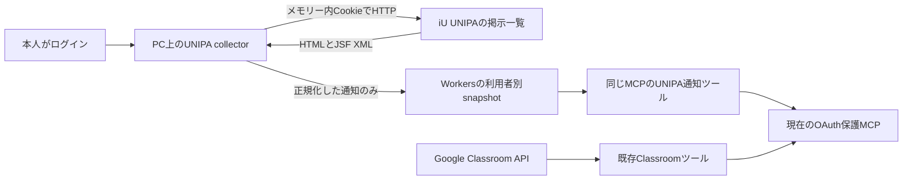

# iU UNIPA RX：内部APIの照合と統合方針

調査日：2026-10-06（Asia/Tokyo）。対象：`https://unipa.i-u.ac.jp/uprx/`。既存MCP：`D:\Work\Projects\Classroom-MCP`、`main`、HEAD `b17238d`。本書は調査結果と実装方針であり、MCP実装・デプロイの完了報告ではない。

**同日の設計更新：** 利用者から「各学生が自分のCloudflareへデプロイし、ID／パスワードをWorkers Secretsへ保存して自動ログインする」方式の指定があった。取得場所・認証情報の保持・PoCの実装順に関する現行方針は[学生別デプロイとSecretsの設計](UNIPA_SELF_HOSTED_SECRETS_DESIGN.md)を採用する。本書のローカルcollector／メモリー内だけの資格情報という実装提案は更新前の案として残す。本学の実測結果、同一MCPの通知Adapter、本文取得を無効とする方針は引き継ぐ。

## 決定

**既存Google Classroom MCPに、UNIPAの通知用Adapterを追加する。現在のiU環境ではHTTP／JSFによる掲示一覧取得を採用する。**

内部Web APIの経路は存在する。しかし、調査したライセンス確認とAPIログインの両経路がHTTP 403を返し、`statusDto.success=false`、メッセージ「本機能はライセンスがないため、使用できません。（WEB-API）」となった。APIが存在しないという結論を、利用可能なAPIがあるという結論に置き換えてはいけない。現在の応答から、当該APIを実装の前提にできない。大学の契約内容そのものは確認していない。

対象は休講、教室変更、UNIPAに配信される大学のお知らせ。資料・課題はClassroomに任せる。出席登録と出席データの収集は対象外。既読更新・履修変更・掲示への回答も提供しない。

本人のPCで取得し、UNIPAの認証情報はメモリー内だけに保持する。Workersへ送るのは正規化した通知データだけ。本文の自動取得は、前回確認した既読化の副作用により初期版で無効とする。

## 1. 今回の本学での実測

### APIの到達性と利用制限

公開クライアントで確認できた経路を本学の同じoriginへ照合した。URLの総当たり、ライセンス制限の回避、アプリの偽装、誤った本人パスワードの送信はしていない。

| 確認                                                      | 条件                                                             | 本学の結果                                                 | 判断                                                                             |
| --------------------------------------------------------- | ---------------------------------------------------------------- | ---------------------------------------------------------- | -------------------------------------------------------------------------------- |
| `GET /uprx/webapi/up/pk/Pky001Resource/login`             | Cookie・認証情報なし                                             | HTTP 500、`text/html`                                      | GETだけでは不存在／利用可否を判定できない。公開実装のログインはPOST              |
| `POST /uprx/webapi/core/up/InitProcResource/checkLicense` | Cookieなし、製品コード`ap`のみ                                   | HTTP 403、`application/json;charset=UTF-8`、ライセンス拒否 | API入口の存在と、当該機能の拒否を確認                                            |
| 同じ`checkLicense`                                        | 認証済みデスクトップの通常Cookieを使用。値は出力せず             | 同じHTTP 403・ライセンス拒否                               | 通常のWebログインによって利用可能にはならなかった                                |
| `POST /uprx/webapi/up/pk/Pky001Resource/login`            | 公開コードの製品指定、`data`は空。ID・パスワードを送信していない | 同じHTTP 403・ライセンス拒否                               | APIログインの入口も現状は採用不可。正しい資格情報でのAPI認証成功は検証していない |

ライセンス応答の本文は、Content-TypeがJSONでも、そのままのJSONではなくpercent-encoded JSONだった。一度デコードすると、トップレベルのキーは`statusDto`、`data`、`langCd`。`data`はnullだった。記録した意味上の抜粋は以下。資格情報やサーバーの生レスポンスを保存したものではない。

```json
{
  "httpStatus": 403,
  "statusDto": {
    "success": false,
    "messageList": ["本機能はライセンスがないため、使用できません。（WEB-API）"]
  },
  "data": null
}
```

この拒否を確認した後、追加の認証入力・APIログインの再試行・他のAPI経路の探索は行っていない。`firstSetting`、端末登録、Push設定、API logout等も呼んでいない。

### 通常Web画面の構成と掲示一覧

| 項目                           | 今回の観測                                                                                                                            |
| ------------------------------ | ------------------------------------------------------------------------------------------------------------------------------------- |
| 認証後の入口                   | `/uprx/up/pk/pky001/Pky00101.xhtml`、通常メニューとポータルを確認                                                                     |
| 掲示板                         | 「共通」→「掲示板」、機能表示`Bsd007`                                                                                                 |
| メニュー遷移                   | `/uprx/up/bs/bsa001/Bsa00101.xhtml`へのフォームPOST、HTTP 200、HTML                                                                   |
| 掲示一覧の現在のform action    | `/uprx/up/bs/bsd007/Bsd00701.xhtml`。アドレスバーのURLとは異なる場合がある                                                            |
| 「全表示」・「すべて表示する」 | 現在のform actionへのXHR POST、HTTP 200、`text/xml`                                                                                   |
| JSF部分更新                    | `<partial-response>`を確認。`funcForm`などの更新HTMLと、別updateの`javax.faces.ViewState`を返す                                       |
| フォーム状態の名前             | `rx-token`、`rx-loginKey`、`rx-deviceKbn`、`rx-loginType`、`javax.faces.ViewState`。値は記録しない                                    |
| 部分更新の要求                 | `Faces-Request: partial/ajax`、`X-Requested-With: XMLHttpRequest`。source、execute、render、イベント、tab index、操作マーカー等を使用 |
| 技術構成                       | `.xhtml`、`javax.faces`、PrimeFaces・jQueryのリソースを実画面で確認。サーバー／DBの製品やバージョンは本調査から特定しない             |
| 一般掲示のグループ             | 教務27件、学生生活11件。他の表示グループは明示的な掲示なし                                                                            |
| 全表示の初期状態               | 15行、総件数38件                                                                                                                      |
| 「すべて表示する」後           | 38行、総件数と一致。追加表示ボタンは消えた                                                                                            |
| 掲示の種類                     | 件名に休講3件、教室変更2件。計5件の授業変更候補が一般掲示にある                                                                       |
| 既読・未読                     | 全38行の操作ラベルで既読10・未読28を確認。本文を開かず再検索した後も同じ38行・10／28                                                  |
| 識別子                         | 調査した一覧に`keijiNo`・`keijiTorkDate`の業務IDを発見できず。動的コンポーネントIDを永続IDにしない                                    |

`core.js`、`custom.pc.js`、`frameComponent.js`、`Bsa00101.js`の、実画面が読み込む4リソースを確認した。今回の4ファイルとポータルのインラインスクリプトでは`webapi`、`webApiLoginInfo`、`keijiNo`を見つけなかった。これはWeb画面全体や製品全体にAPIがないことの証明ではない。

一覧表示を操作した際の通常通信はHTML／JSF XMLだった。JSONのHTTP 403は、今回こちらが明示的に照合したAPI要求の応答であり、掲示UIがJSON APIを使ったという観測ではない。

初期PoCは「時間割変更」欄だけを収集してはいけない。一般掲示を全件取得してから分類する。件数38は調査時点でこの学生に配信・表示された範囲であり、過去の全履歴や全学生の配信を意味しない。


画像は全表示タブと休講掲示があることの確認用。総件数と既読・未読の数は上記のDOM照合結果による。

## 2. 前回の検証から引き継ぐ条件

以下は2026-10-05の保存済み調査記録による。今回、資格情報を再取得したり、未読本文を開いて副作用を再現したりはしていない。

- 独立したメモリー内Cookie jarで、Cookieなしの初回HTTPログイン→別JSESSIONID→ポータル→掲示板→全38件の取得まで成功した。ブラウザ内のHTTP通信による結果であり、独立Node.jsプロセスやCloudflare Workersからの成功を意味しない。
- 当時の`JSESSIONID`はPath `/uprx`、Secure、HttpOnly、セッションCookieだった。SameSite、正確な有効期限、同時ログイン条件は未確定。Cookie値を移すだけのブラウザへの引き継ぎは成功していない。
- 専用の時間割変更欄は0件だったが、一般掲示には休講・教室変更があった。今回の一般掲示も同じ分類上の注意を支持する。
- 未読の休講・教室変更の本文を専用HTTPセッションで取得し、後続検索すると既読10／未読28から11／27へ変わった。各対象を個別に元へ戻し、再検索で10／28を確認した。別セッションでも既読副作用は解消しなかった。
- 詳細本文は差出人、カテゴリ、件名、本文、掲示期間の5フィールドを持つ。ラベルは第1td／label、値は第2td。掲示期間と授業変更の適用期間は別。教室変更には開始日以降の継続変更があった。
- 認証なし・失効時でもHTTP 200のログイン／ログアウトHTMLが返る。`javax.faces.ViewRoot`のルート置換を見落とした検証コードは古い一覧を成功と誤認したため、その後の検索結果は成功確認から除外済み。

したがって、**別Cookie jarは画面状態の競合を避ける対策であり、本文を副作用なしで収集する対策ではない。** 自動で未読へ戻す方式も、本人が読んだ状態を消す競合があるため採用しない。

以前の詳細記録： [UNIPA_VALIDATION_RESULTS.md](C:/Users/ibimu/Documents/Codex/2026-10-05/referenced-chatgpt-conversation-this-is-an/outputs/UNIPA_VALIDATION_RESULTS.md)。本書だけでも現段階の選定理由と実装条件を確認できる。

## 3. 参照会話と公開コードから分かったこと

参照会話「UNIPA RX API調査」のAPI経路を、大学が異なる公開実装で照合した。参照会話の広い取得対象を、そのまま本件の実装対象にはしない。

| 一次資料                                                                                                                                                                                                                                        | 読み取れること                                                                                                                                                     | 本学への適用限界                                                                        |
| ----------------------------------------------------------------------------------------------------------------------------------------------------------------------------------------------------------------------------------------------- | ------------------------------------------------------------------------------------------------------------------------------------------------------------------ | --------------------------------------------------------------------------------------- |
| [cit-class-rs / lib.rs](https://github.com/nyan7natsu/cit-class-rs/blob/a062a699424382f8fee0ca837c28b8a4e80eef38/src/lib.rs)、[types.rs](https://github.com/nyan7natsu/cit-class-rs/blob/a062a699424382f8fee0ca837c28b8a4e80eef38/src/types.rs) | 千葉工業大学向けの実コード。ログイン・授業メニュー取得はPOST。URLデコード後にJSON解析。ログイン応答の`encryptedPassword`を後続要求の`encryptedLoginPassword`へ渡す | iUで当該APIが有効という証拠にはならない                                                 |
| [TUTnextApp / AuthService.swift](https://github.com/Ukenn2112/TUTnextApp/blob/3a33298f5c41a532b1c2d67a6fde5b45006da914/tama/Services/Auth/AuthService.swift)                                                                                    | 別大学のログイン要求と、製品指定・後続認証の構造を確認                                                                                                             | iUで認証成功する条件は未検証。ログ保存・端末登録の振る舞いは流用しない                  |
| [TUTnextApp / UNIPA_API.md](https://github.com/Ukenn2112/TUTnextApp/blob/3a33298f5c41a532b1c2d67a6fde5b45006da914/UNIPA_API.md)                                                                                                                 | 作者のアプリ解析資料。checkLicense経路、共通エンベロープ、WebViewの一般掲示Bsd507系を記載                                                                          | 公式Developer APIの仕様書ではない。iUでBsd507、業務ID、一般掲示JSON取得は確認していない |

公開実装の授業メニューには`jgkmDtoList`の授業・教室情報と`keijiCnt`がある。ただし、未読件数を取得できることは、一般掲示の一覧・本文を取得できることと別である。授業詳細APIも一般掲示全件の代替とは確認していない。

`encryptedPassword`／`encryptedLoginPassword`や自動ログインコードは、再利用できる認証情報として扱う。暗号化された文字列という名称を理由に、MCP結果・ログ・キャッシュ・クラウドへ出してよいとは判断しない。

一般掲示がWebView／JSFで提供される構成もあるため、将来APIが利用可能になっても、休講・教室変更・大学のお知らせをすべてJSONだけで取得できるとは約束できない。認証情報を含む`webApiLoginInfo`のURLは、URLログ等への流出を避けるため採用しない。本調査ではアプリの逆解析、暗号鍵の利用、Push端末登録は行っていない。

## 4. 3案の比較

| 案                     | 本件での利点                                                                                 | 追加負担                                                   | 判断                                                  |
| ---------------------- | -------------------------------------------------------------------------------------------- | ---------------------------------------------------------- | ----------------------------------------------------- |
| 既存MCPのUNIPA Adapter | 既存Google OAuth、MCP入口、Workersデプロイを使える。利用者は同じ接続で課題と通知を確認できる | UNIPA用のデータモデル、ローカルcollector、データ同期を追加 | **推奨**。通知3ツール程度の小さな追加にする           |
| UNIPA専用MCP           | Google接続なしで使える。運用・障害・認証境界を完全に分離しやすい                             | MCPの登録・認証・接続・デプロイ・保守がもう1組必要         | UNIPA単独利用や運営主体の分離が必要になった時に再検討 |
| 共通Aggregator MCP     | 多数の学務サービスを一括管理できる                                                           | 認証委譲、通信、共通モデル、障害処理が増える               | 現状の2サービス・役割分担では採用しない               |

ローカルcollectorは取得処理の配置であり、別のMCPを設けるという意味ではない。まず通知と課題を別の用途別ツールとして提供し、共通のAssignment型や複雑なProvider継承階層を作らない。

## 5. 既存構成との接続

今回、`src/index.ts`、`src/mcp.ts`、`src/types.ts`、`wrangler.jsonc`、`package.json`を再読した。現行はTypeScript、stateless `createMcpHandler`、Google OAuth／PKCE、5つのClassroomツール、`OAUTH_KV`、静的assets。`nodejs_compat`と`global_fetch_strictly_public`を使用。D1、Durable Objects、ブラウザ基盤はない。

`/mcp`入口ではMCP scopeだけでなく、Google access tokenの有効期限と許可メールも検証している。初期版はこの利用者認証を維持する。UNIPAのCookieをGoogleのOAuth grantへ混ぜない。UNIPA取得失敗は通知ツールの状態として返し、Classroomの取得処理へ波及させない。ただし現行入口のGoogle認証が失効した場合は、UNIPAツールにも入れない。UNIPA単独の認証入口が既にあるとは扱わない。



次の配置を実装時の目安にする。以下のファイルはまだ実装していない。

```text
collector/
  unipa-session.ts     # 本人ログイン、メモリー内Cookie jar、失効
  unipa-jsf.ts         # form action、動的操作ID、ViewState、XML更新
  unipa-notices.ts     # 掲示板→全表示→全件表示→件数照合
  sync.ts             # 認証済みの本人として正規化snapshotだけを送る
src/
  unipa/types.ts       # Notice、ChangeCandidate、ConnectionStatus
  unipa/changes.ts     # 件名の分類、未確認の適用日・教室の扱い
  unipa/snapshot.ts    # 利用者別・期限付きのデータを読む
  tools/unipa.ts       # 通知一覧、授業変更候補、接続状態
  mcp.ts              # 既存ツールに小さな登録処理を追加
  index.ts            # 必要な段階でsnapshot同期の認証済み入口を追加
```

collectorとWorkerの間の同期は別途必要。Workerが本人PCのメモリーへ直接アクセスできるとは扱わない。最初のローカルPoCは取得結果をメモリー内で確認し、その後に同期・MCP追加へ進める。

## 6. 認証と取得戦略

### 現在採用するHTTP／JSFフロー

1. ローカルcollectorを起動し、本人がID・パスワードを入力する。入力、Cookie、rx系状態、ViewStateをメモリー以外に書かない。
2. 新しいログインフォームを取得し、実際のactionと状態で通常ログインする。認証済みページの存在を確認する。本人が通常ログインするブラウザ経路も利用可能にするが、ブラウザCookieの自動引き継ぎは成功済み機能とは扱わない。
3. 実際のメニュー操作から掲示板へ進み、現在のform actionを採用する。
4. 全表示を選び、DOM内の「すべて表示する」を必要な場合だけ送る。取得行数が総件数と一致するまで、明示された取得操作のみを使う。
5. 件名、カテゴリ、差出人、掲示日、重要表示、観測した既読状態等を正規化する。詳細リンク、既読・フラグ更新、回答操作は送らない。
6. 一覧の完全性が確認できた時だけ成功snapshotを更新する。セッション失効時は取得を停止し、メモリー内資格情報を破棄して本人の再接続待ちにする。

UNIPA応答中のJavaScriptをHTTP parserで実行しない。JSF XMLはDOM／XML parserで解析し、`redirect`、`error`、ルート置換、ログイン／ログアウトHTMLを先に判定する。ViewStateが別updateにある場合も更新する。状態値が前回と同じでも固定値にしない。

動的`j_idt`番号、行番号、tab indexをソースへ固定しない。通常フォーム送信のチェックボックス値を、掲示の「既読更新」命令と混同しない。操作source・イベント・マーカーを限定した一覧操作のallowlistを使う。

### API優先という原則の具体化

本学の現状ではAPI probeを毎回繰り返さず、HTTP／JSFを使う。大学側で正式に利用可能なAPIと利用条件を確認できた場合だけ、認証・一般掲示の網羅性・本文の既読副作用を検証して差し替える。

API対応を後から加える場合、Content-Type、HTTP status、JSON／percent-encoded JSON、`statusDto.success`、必要なdata schemaを確認する。デコードは必要な場合に一度だけ行い、HTMLに対して無理にJSON解析しない。APIに存在しない機能はJSFへ戻す。ブラウザ自動化は本人ログインやHTTPだけでは成立しない操作に限定する。

## 7. 通知データとツール

ClassroomのCourse／Assignmentへ一般掲示を変換しない。初期版は次の内容を持つ。

| 型               | 主な内容                                                                                                                                      |
| ---------------- | --------------------------------------------------------------------------------------------------------------------------------------------- |
| Notice           | source=`unipa`、title、category、sender、掲示日の原表記、解析可能な掲載日時、importance、observedReadState、公式ポータルURL、取得元snapshot   |
| ChangeCandidate  | kind=`CANCELLATION`／`ROOM_CHANGE`、件名の授業名・曜日・時限・日付の原表記、根拠=`title_only`、本文未取得、適用期間・新旧教室は未確認ならnull |
| Snapshot         | sourceFetchedAt、Worker側receivedAt、totalCount、rowCount、complete、stale、warnings、collectorのschemaVersion                                |
| ConnectionStatus | connected／auth_required／stale／unavailable、最後の成功日時、次回取得可能時刻、資格情報を含まない理由コード                                  |

日付に年がない時や「開始日以降」の意味が分からない時は、確定した授業変更として返さない。掲載日・掲載終了日を、休講日や教室変更の終了日に置き換えない。時間割やClassroomとの授業対応も、名前の曖昧一致で自動確定しない。

一覧に安定業務IDがないため、初期の照合用fingerprintは利用者範囲＋件名＋カテゴリ＋差出人＋掲示日の正規化値から作る。これは正式な掲示IDではない。同じメタデータの複数行は件数を保持し、黙って1件へ潰さない。訂正・撤回の確実な識別は未解決として扱う。動的操作IDは取得中だけ保持する。

安全な公式URLは確認済みポータルの`https://unipa.i-u.ac.jp/uprx/`。業務IDがない段階で個別詳細URLを捏造せず、掲示件名を併記して本人が探せるようにする。認証情報をURLへ含めない。

提供するツールは以下の3つに絞る。

- `unipa_list_announcements`：一覧の取得結果。カテゴリ・日付・未読のローカル絞り込みと完全性を返す。
- `unipa_list_schedule_changes`：休講・教室変更の候補と、根拠・未確認項目を返す。空配列だけで「変更なし」と断言しない。
- `unipa_connection_status`：接続・鮮度・再ログインの必要性を返す。

これらは保存済みsnapshotを読むMCPツールとして公開する。UNIPA本文取得を既存Classroomツールの`readOnlyHint`で読み取り専用と宣言しない。掲示の内容は不信な情報源として扱い、モデルへの指示として実行しない。

## 8. 同期・キャッシュ・失敗処理

以下は初期値の提案であり、大学が認めた頻度や実装済み設定ではない。

- 取得は1利用者・1セッションで直列化。起動時／本人要求時と、起動中の15分間隔を目安にする。手動更新にも最低60秒の間隔を置く。ログインは自動で繰り返さない。
- HTMLは1要求15秒、1同期120秒、30要求・1000行を上限の目安にする。上限到達は不完全な結果として返す。0件は明示的な0件表示と正常応答がある場合だけ確定する。
- 通信断・429・503は短いバックオフとjitter、存在すればRetry-Afterに従う。応答を失ったJSF POSTを同じViewStateで盲目的に再送せず、最新フォームから安全な一覧手順をやり直すか停止する。
- `WEB_API_UNLICENSED`は再試行しない。`AUTH_REQUIRED`／`SESSION_EXPIRED`は本人の再ログイン待ち。`UNEXPECTED_RESPONSE`、`INCOMPLETE_LIST`は最後の完全snapshotを残し、stale・warningsを返す。失敗した取得で成功日時や完全な空一覧を上書きしない。
- Workerへ同期する段階では、通知だけの専用`UNIPA_SNAPSHOTS` KVを追加する。既存`OAUTH_KV`へ掲示やUNIPA資格情報を混ぜない。保持期間はまず24時間、45分を超えた結果はstaleの目安とする。
- 同期入口は利用者認証と本文schemaを検証し、保存キーのsubjectを認証結果から決める。リクエスト本文のsubject指定を信用しない。ローカル側の同期用access tokenもメモリー内だけに保持する。
- 現行OAuth保護ルートは`/mcp`だけ。新しい同期URLを追加するだけでは保護されないため、同期入口にも明示的なscope・利用者検証が必要。scope等の具体設定は実装時にライブラリの対応を確認する。
- snapshotはmetadataと通知を一つの値にまとめる。KVの結果整合性を厳密な即時同期として扱わない。初期版は単一collector／単一writerとし、取得時刻・受信時刻・versionを表示する。複数writerや厳密な直後参照が必要になった時だけDO等を再検討する。
- 正規化した大学通知も非公開の配信内容であり、Worker／MCPへ転送する範囲と保存期間を明示する。raw HTML/XML、Cookie、ViewState、パスワード、API資格情報、HARは保存・送信しない。ログは理由コード・件数・時間に限定する。

## 9. 最小PoCの実装順と完了条件

1. **合成fixtureとJSF parser**：dynamic ID、別updateのViewState、全15→38件、明示的0件、部分的200、login HTML、ルート置換、XML error／redirectを検証する。実際のHTMLをfixtureへ保存しない。
2. **独立Node.jsの輸送層**：正式なCookie jarと通常フォームで、本人ログイン→掲示一覧だけを取得する。資格情報はメモリー内のみ。前回のブラウザ内HTTP成功をNode.jsの実動作確認に置き換える。
3. **一覧collector**：38件等の総数照合、休講・教室変更の件名分類、本文未取得・不明値、失効・レート制御を実装する。一覧取得の前後・再検索後で既読数が変わらないことを確認する。
4. **ローカルPoCの確認**：接続失効、不完全一覧、重複行、年を欠く日付、継続変更を取り違えない。これで通知だけの取得が成立するか判断する。
5. **認証済みsnapshot同期**：必要な場合に専用KVと同期入口を追加する。別利用者のデータを読めないこと、失敗結果が成功snapshotを消さないこと、staleが分かることを検証する。
6. **同一MCPの3ツール**：既存の5つのClassroomツールとGoogle認証を保ち、UNIPAの失敗を通知ツールへ閉じ込める。対象実装のテスト、既存回帰検証、dry-runの後に本番反映を検討する。

大学側でAPI利用が可能になるまで待つ必要はない。現在確認できているWeb一覧の読み取りからPoCを始められる。本文取得、大学文書の添付処理、時間割照合、「今日の概要」、他大学対応は、必要性と安全な取得条件が成立した順に追加する。

## 10. 完了した範囲と残る確認

今回、参照会話の読取、公開実装との照合、本学APIの到達性・ライセンス拒否の確認、通常ログイン後の掲示一覧とJSF通信の再確認、全件・未読状態の照合、現行ソース／設定の再読、統合方針の更新を実施した。

未確認は、大学の正式なAPI契約・自動取得の許容条件、独立Node.js／Workersからの認証、一般掲示の別経路での安定業務ID・副作用なしの本文取得、長期運用での仕様変更・セッション条件。公開コードの存在や本人の調査許可を、大学からの運用許可の証拠とは扱わない。これは大学・提供元へ確認すべき運用条件であり、現在の読み取り検証を停止するための追加承認要求ではない。

現行MCPソース・設定は変更していない。追加したのは本書と資格情報を含まない確認画像。実装変更がないため、前回成功した42件の既存テストを今回は再実行していない。実装・同期・本番デプロイの成功を報告する段階ではない。

今回、パスワード入力欄の読み取りやAPI資格情報の取得は行っていない。Cookie・フォーム状態を含む認証情報の値は表示・ファイル保存・ログ出力せず、通信の一時解析はメモリー内に限定した。保存したのは構造と非認証の結果だけ。既読・フラグ等の更新、出席に関する操作、本文の表示はしていない。通信監視を停止し、本人のUNIPAタブは認証済み掲示一覧のまま残した。
